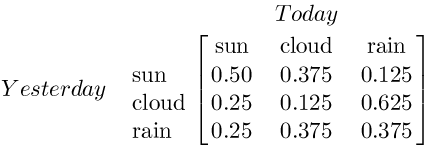
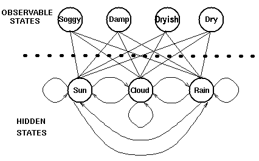
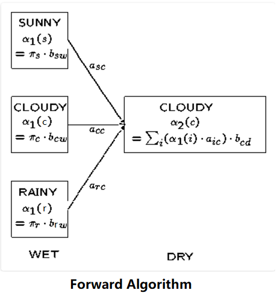

<!-- TOC -->

- [HiddenMarkovModels](#hiddenmarkovmodels)
    - [一、介绍（Introduction）](#一介绍introduction)
    - [二、生成模式（Generating Patterns）](#二生成模式generating-patterns)
        - [1、确定性模式（Deterministic Patterns）](#1确定性模式deterministic-patterns)
        - [2、非确定性模式（Non-deterministic patterns）](#2非确定性模式non-deterministic-patterns)
        - [3、总结](#3总结)
    - [三、隐藏模式（Hidden Patterns）](#三隐藏模式hidden-patterns)
        - [1、马尔科夫过程的局限性](#1马尔科夫过程的局限性)
        - [2、隐马尔科夫模型（Hidden Markov Models）](#2隐马尔科夫模型hidden-markov-models)
        - [3、总结（Summary）](#3总结summary)
    - [四、隐马尔科夫模型（Hidden Markov Models）](#四隐马尔科夫模型hidden-markov-models)
        - [1、定义（Definition of a hidden Markov model）](#1定义definition-of-a-hidden-markov-model)
        - [2、应用（Uses associated with HMMs）](#2应用uses-associated-with-hmms)
            - [a) 评估（Evaluation）](#a-评估evaluation)
            - [b) 解码（ Decoding）](#b-解码-decoding)
            - [c) 学习（Learning）](#c-学习learning)
        - [3、总结（Summary）](#3总结summary-1)
    - [五、前向算法（Forward Algorithm）](#五前向算法forward-algorithm)
        - [section 1 - 计算观察序列的概率](#section-1---计算观察序列的概率)
            - [1.穷举搜索（ Exhaustive search for solution）](#1穷举搜索-exhaustive-search-for-solution)
            - [2.使用递归降低问题复杂度](#2使用递归降低问题复杂度)
                - [2a.局部概率(alpha's)](#2a局部概率alphas)
                - [2b.计算t=1时的局部概率alpha's](#2b计算t1时的局部概率alphas)
                - [2c.计算t>1时的局部概率alpha's](#2c计算t1时的局部概率alphas)
                - [2d.降低计算复杂度](#2d降低计算复杂度)
            - [3.总结](#3总结)
        - [section 2 - 前向算法定义](#section-2---前向算法定义)
        - [section 3 - 总结](#section-3---总结)

<!-- /TOC -->
# HiddenMarkovModels

    本文转载自http://www.52nlp.cn，这里略有修改。
    
## 一、介绍（Introduction）

我们通常都习惯寻找**一个事物在一段时间里的变化模式（规律）**。这些模式发生在很多领域，比如计算机中的指令序列，句子中的词语顺序和口语单词中的音素序列等等，**事实上任何领域中的一系列事件都有可能产生有用的模式。** 

考虑一个简单的例子，有人试图通过一片海藻推断天气——民间传说告诉我们‘湿透的’海藻意味着潮湿阴雨，而‘干燥的’海藻则意味着阳光灿烂。如果它处于一个中间状态（‘有湿气’），我们就无法确定天气如何。然而，天气的状态并没有受限于海藻的状态，所以我们可以在观察的基础上预测天气是雨天或晴天的可能性。另一个有用的线索是前一天的天气状态（或者，至少是它的可能状态）——通过综合昨天的天气及相应观察到的海藻状态，我们有可能更好的预测今天的天气。

这是本教程中我们将考虑的一个典型的系统类型。

首先，我们将介绍产生**概率模式**的系统，如晴天及雨天间的天气波动。

然后，我们将会看到这样一个系统，我们希望预测的状态并不是观察到的——其底层系统是隐藏的。在上面的例子中，观察到的序列将是海藻而隐藏的系统将是实际的天气。

最后，我们会利用已经建立的模型解决一些实际的问题。对于上述例子，我们想知道：

- 1. 给出一个星期每天的海藻观察状态，之后的天气将会是什么?

- 2. 给定一个海藻的观察状态序列，预测一下此时是冬季还是夏季？直观地，如果一段时间内海藻都是干燥的，那么这段时间很可能是夏季，反之，如果一段时间内海藻都是潮湿的，那么这段时间可能是冬季。

## 二、生成模式（Generating Patterns）

### 1、确定性模式（Deterministic Patterns）

考虑一套交通信号灯，灯的颜色变化序列依次是红色-红色/黄色-绿色-黄色-红色。这个序列可以作为一个状态机器，交通信号灯的不同状态都紧跟着上一个状态。

<div align=center></div>

注意每一个状态都是唯一的依赖于前一个状态，所以，如果交通灯为绿色，那么下一个颜色状态将始终是黄色——也就是说，该系统是确定性的。确定性系统相对比较容易理解和分析，因为状态间的转移是完全已知的。

### 2、非确定性模式（Non-deterministic patterns）

为了使天气那个例子更符合实际，加入第三个状态——多云。与交通信号灯例子不同，我们并不期望这三个天气状态之间的变化是确定性的，但是我们依然希望对这个系统建模以便生成一个天气变化模式（规律）。

**一种做法是假设模型的当前状态仅仅依赖于前面的几个状态，这被称为马尔科夫假设，它极大地简化了问题。显然，这可能是一种粗糙的假设，并且因此可能将一些非常重要的信息丢失。**

当考虑天气问题时，马尔科夫假设假定今天的天气只能通过过去几天已知的天气情况进行预测——而对于其他因素，譬如风力、气压等则没有考虑。在这个例子以及其他相似的例子中，这样的假设显然是不现实的。然而，由于这样经过简化的系统可以用来分析，我们常常接受这样的知识假设，虽然它产生的某些信息不完全准确。

<div align=center>  </div>

**一个马尔科夫过程是状态间的转移仅依赖于前n个状态的过程。这个过程被称之为n阶马尔科夫模型，其中n是影响下一个状态选择的（前）n个状态。**最简单的马尔科夫过程是一阶模型，它的状态选择仅与前一个状态有关。这里要注意它与确定性系统并不相同，因为**下一个状态的选择由相应的概率决定，并不是确定性的。**

下图是天气例子中状态间所有可能的**一阶状态转移**情况：

<div align=center></div>

对于有M个状态的一阶马尔科夫模型，共有M^2个状态转移（it is possible for any one state to follow another）。每一个状态转移都有一个概率值，称为**状态转移概率——这是从一个状态转移到另一个状态的概率**。所有的M^2个概率可以用一个状态转移矩阵表示。**注意这些概率并不随时间变化而不同——这是一个非常重要（但常常不符合实际）的假设。**

下面的状态转移矩阵显示的是天气例子中可能的状态转移概率：

<div align=center></div>

也就是说，如果昨天是晴天，那么今天是晴天的概率为0.5，是多云的概率为0.375。注意，每一行的概率之和为1。

要初始化这样一个系统，我们需要确定起始日天气的（或可能的）情况，定义其为一个初始概率向量，称为  向量。

<div align=center></div>

也就是说，第一天为晴天的概率为1。

现在我们定义一个一阶马尔科夫过程如下：

- 状态：三个状态——晴天，多云，雨天。
- 向量：定义系统初始化时每一个状态的概率。
- 状态转移矩阵：给定前一天天气情况下的当前天气概率。

任何一个可以用这种方式描述的系统都是一个马尔科夫过程。

### 3、总结

我们尝试识别时间变化中的模式，并且为了达到这个目我们试图对这个过程建模以便产生这样的模式。

我们使用了离散时间点、离散状态以及做了马尔科夫假设。在采用了这些假设之后，系统产生了这个被描述为马尔科夫过程的模式，它包含了一个向量（初始概率）和一个状态转移矩阵。

关于假设，重要的一点是**状态转移矩阵并不随时间的改变而改变——这个矩阵在整个系统的生命周期中是固定不变的**。

## 三、隐藏模式（Hidden Patterns）

### 1、马尔科夫过程的局限性

**在某些情况下，我们希望找到的模式还不能够充分地被马尔科夫过程描述**。

回顾一下天气那个例子，一个隐士也许不能够直接获取到天气的观察情况，但是他有一些水藻。民间传说告诉我们水藻的状态与天气状态有一定的概率关系——天气和水藻的状态是紧密相关的。在这个例子中我们有两组状态，观察的状态（水藻的状态）和隐藏的状态（天气的状态）。

我们希望为隐士设计一种算法，在不能够直接观察天气的情况下，通过水藻和马尔科夫假设来预测天气。

一个更实际的问题是语音识别，我们听到的声音是来自于声带、喉咙大小、舌头位置以及其他一些东西的组合结果。所有这些因素相互作用产生一个单词的声音，一套语音识别系统检测的声音就是来自于个人发音时身体内部物理变化所引起的不断改变的声音。

一些语音识别装置工作的原理是将内部的语音产出看作是隐藏的状态，而将声音结果作为一系列观察的状态，这些由语音过程生成并且最好的近似了实际（隐藏）的状态。

在这两个例子中，需要着重指出的是，**隐藏状态的数目与观察状态的数目可以是不同的**。一个包含三个状态的天气系统（晴天、多云、雨天）中，可以观察到4个等级的海藻湿润情况（干、稍干、潮湿、湿润）；纯粹的语音可以由80个音素描述，而身体的发音系统会产生出不同数目的声音，或者比80多，或者比80少。

在这种情况下，**观察到的状态序列与隐藏过程有一定的概率关系**。我们使用隐马尔科夫模型对这样的过程建模，**这个模型包含了一个底层隐藏的随时间改变的马尔科夫过程，以及一个与隐藏状态某种程度相关的可观察到的状态集合。**

### 2、隐马尔科夫模型（Hidden Markov Models）

下图显示的是天气例子中的隐藏状态和观察状态。假设隐藏状态（实际的天气）由一个简单的一阶马尔科夫过程描述，那么它们之间都相互连接。

<div align=center></div>

隐藏状态和观察状态之间的连接线表示的是：**在给定的马尔科夫过程中，一个特定的隐藏状态生成特定的观察状态的概率**。这很清晰的表明，对于一个隐藏状态，其“进入”所有观察状态的概率之和为1，即有：

<div align=center></div>

对于条件概率，可以酱理解：P(A|B)说的是在A已经发生的情况下（即是结果，明显可观察到的状态）B发生（即是原因，隐藏导致这一状态的“导火线”）的概率。

除了定义马尔科夫过程的概率关系，我们还需定义一个名为 混淆矩阵（confusion matrix）的矩阵，它**包含了给定一个隐藏状态后得到的观察状态的概率**。对于天气例子，混淆矩阵是：

<div align=center></div>

注意矩阵的每一行之和是1。

### 3、总结（Summary）

我们已经看到了**在一些过程中一个观察序列与一个底层马尔科夫过程（underlying Markov process）是概率相关的**。在这些例子中，观察状态的数目可以和隐藏状态的数目可以不相同。

我们使用一个**隐马尔科夫模型（HMM）**对这些例子建模。这个模型包含两组状态集合和三组概率集合：

- 隐藏状态：一个系统的（真实）状态，可以由一个马尔科夫过程进行描述（例如，天气）。
- 观察状态：在这个过程中‘可视’的状态（例如，海藻的湿度）。
- 向量：包含了（隐）模型在时间t=1时一个特殊的隐藏状态的概率（初始概率）。
- 状态转移矩阵：包含了一个隐藏状态到另一个隐藏状态的概率。
- 混淆矩阵：给定隐马尔科夫模型，包含了处于某个隐藏状态时**可观察到**某个观察状态的概率。

因此，一个隐马尔科夫模型是在一个标准的马尔科夫过程中引入一组观察状态，以及其与隐藏状态间的一些概率关系。

## 四、隐马尔科夫模型（Hidden Markov Models）

### 1、定义（Definition of a hidden Markov model）

一个隐马尔科夫模型是一个三元组（, A, B）。
- 初始化概率向量：
- 状态转移矩阵：
- 混淆矩阵：

在状态转移矩阵及混淆矩阵中的每一个概率都是**时间无关**的——也就是说，当系统演化时这些矩阵并不随时间改变。实际上，这是马尔科夫模型关于真实世界**最不现实**的一个假设。

### 2、应用（Uses associated with HMMs）

一旦一个系统可以作为HMM被描述，就可以用来解决三个基本问题。

前两个是模式识别的问题：**给定HMM求一个观察序列的概率（评估）；搜索最有可能生成一个观察序列的隐藏状态序列（解码）**。

第三个问题是：**给定观察序列生成一个HMM（学习）**。

#### a) 评估（Evaluation）

考虑这样的问题，我们有一些描述不同系统的隐马尔科夫模型（也就是一些(,A,B)三元组的集合）及一个观察序列。我们想知道**哪一个HMM最有可能产生了这个给定的观察序列**。例如，对于海藻来说，我们也许会有一个“夏季”模型和一个“冬季”模型，因为不同季节之间的情况是不同的——我们也许想根据海藻湿度的观察序列来确定当前的季节。

我们使用**前向算法（forward algorithm）**来计算在给定一些隐马尔科夫模型（HMM）后观察序列的概率，并因此选择最合适的隐马尔科夫模型(HMM)。

这种类型的问题出现在语音识别中，其中将使用大量的马尔科夫模型，每个模型都对特定单词进行建模。An observation sequence is formed from a spoken word, and this word is recognised by identifying the most probable HMM for the observations.（感觉翻译起来比较别扭，所以还是直接贴原文吧）

#### b) 解码（ Decoding）

**给定观察序列搜索最可能的隐藏状态序列。**

另一个相关问题，也是最感兴趣的一个，就是搜索生成输出序列的隐藏状态序列。在许多情况下我们对于模型中的隐藏状态更感兴趣，因为它们代表了一些更有价值的东西，而这些东西通常不能直接观察到。

考虑海藻和天气这个例子，一个盲人隐士只能感觉到海藻的状态，但是他更想知道天气的情况，天气状态在这里就是隐藏状态。

我们使用**Viterbi算法（Viterbi algorithm）**来确定（搜索）在已知观察序列及HMM下最可能的隐藏状态序列。

Viterbi算法（Viterbi algorithm）的另一广泛应用是自然语言处理中的词性标注。在词性标注中，句子中的单词是观察状态，词性（语法类别）是隐藏状态（注意对于许多单词，如wind，fish拥有不止一个词性）。对于每句话中的单词，通过搜索其最可能的隐藏状态，我们就可以在给定的上下文中找到每个单词最可能的词性标注。

#### c) 学习（Learning）

**根据观察序列生成隐马尔科夫模型。**

第三个问题，也是与HMM相关的问题中**最难的**，根据一个观察序列（来自于已知的集合），以及与其有关的一个隐藏状态集，估计一个最合适的隐马尔科夫模型（HMM），也就是确定对已知序列描述的最合适的（,A,B）三元组。

当矩阵A和B不能够直接被（估计）测量时，**前向-后向算法（forward-backward algorithm）被用来进行学习（参数估计）**，这也是实际应用中常见的情况。

### 3、总结（Summary）

由一个向量和两个矩阵(,A,B)描述的隐马尔科夫模型对于实际系统有着巨大的价值，虽然经常只是一种近似，但它们却是经得起分析的。隐马尔科夫模型通常解决的问题以及其类型、使用算法见下表：

解决的问题 |类型| 使用算法
---------|----------|---------
给定一个观察序列，求最可能匹配的系统 | 评估 | 前向算法（forward algorithm）
对于已生成的一个观察序列，确定最可能的隐藏状态序列 | 解码 | Viterbi 算法（Viterbi algorithm）
对于已生成的观察序列，决定最可能的模型参数 | 学习 | 前向-后向算法（forward-backward algorithm）

## 五、前向算法（Forward Algorithm）

### section 1 - 计算观察序列的概率

#### 1.穷举搜索（ Exhaustive search for solution）

给定隐马尔科夫模型，也就是在模型参数（, A, B)已知的情况下，我们想找到观察序列的概率。

还是考虑天气这个例子，我们有一个用来描述天气及与它密切相关的海藻湿度状态的隐马尔科夫模型(HMM)，另外我们还有一个海藻的湿度状态观察序列。假设连续3天海藻湿度的观察结果是（干燥、湿润(damp)、湿透(soggy)）——而这三天每一天都可能是晴天、多云或下雨，对于观察序列以及隐藏的状态，可以将其视为网格(trellis)：

<div align=center></div>

网格中的每一列都显示了可能的的天气状态，并且每一列中的每个状态都与相邻列中的每一个状态相连。而其状态间的转移都由状态转移矩阵提供一个概率。在每一列下面都是某个时间点上的观察状态，给定任一个隐藏状态所得到的**可观察**状态的概率由混淆矩阵提供。

可以看出，一种计算观察序列概率的方法是找到每一个可能的隐藏状态，并且将这些隐藏状态下的观察序列概率相加。对于上面那个（天气）例子，将有3^3 = 27种不同的天气序列可能性，因此，观察序列的概率是：

```
Pr(dry,damp,soggy | HMM) = Pr(dry,damp,soggy | sunny,sunny,sunny) 
                         + Pr(dry,damp,soggy | sunny,sunny ,cloudy)
                         + Pr(dry,damp,soggy | sunny,sunny ,rainy) 
                         + . . . 
                         + Pr(dry,damp,soggy | rainy,rainy ,rainy)
```

用这种方式计算观察序列概率极为昂贵，特别对于大的模型或较长的序列，因此我们**可以利用这些概率的时间不变性来减少问题的复杂度**。

#### 2.使用递归降低问题复杂度

给定一个隐马尔科夫模型（HMM），我们将考虑递归地计算一个观察序列的概率。我们首先定义**局部概率（partial probability）**,**它是到达网格中的某个中间状态时的概率**。然后，我们将介绍如何在t=1和t=n(>1)时计算这些局部概率。

假设一个T-长观察序列是：

##### 2a.局部概率(alpha's)

考虑下面这个网格，它显示的是天气状态及对于观察序列干燥，湿润及湿透的一阶状态转移情况：

<div align=center></div>

我们可以将计算 到达网格中某个中间状态 的概率作为 所有到达这个状态的可能路径 的**概率求和**问题。

例如，t=2时位于“多云”状态的局部概率通过如下路径计算得出：

<div align=center></div>

我们定义t时刻位于状态j的局部概率为at(j)——这个局部概率计算如下：

```
at(j)= Pr(观察状态|隐藏状态j) x Pr(t时刻所有指向j状态的路径）
```

对于最后的观察状态，其局部概率包括了通过所有可能的路径到达这些状态的概率——例如，对于上述网格，最终的局部概率通过如下路径计算得出：

<div align=center></div>

由此可见，对于这些最终局部概率求和等价于对于网格中所有可能的路径概率求和，也就求出了给定隐马尔科夫模型(HMM)后的观察序列概率。

第3节给出了一个计算这些概率的动态示例。

##### 2b.计算t=1时的局部概率alpha's

我们按如下公式计算局部概率：

```
at(j)= Pr(观察状态|隐藏状态j) x Pr(t时刻所有指向j状态的路径）
```

特别当t=1时，没有任何指向当前状态的路径。故t=1时位于当前状态的概率是初始概率，即Pr(state|t=1)=P(state)，因此，t=1时的局部概率等于当前状态的初始概率乘以相关的观察概率：

<div align=center></div>

所以初始时刻状态j的局部概率依赖于此状态的初始概率及相应时刻我们所见的观察概率。

##### 2c.计算t>1时的局部概率alpha's

我们再次回顾局部概率的计算公式如下：

```
at(j)= Pr(观察状态|隐藏状态j) x Pr(t时刻所有指向j状态的路径）
```

我们可以假设（递归地），乘号左边项“Pr( 观察状态 | 隐藏状态j )”已经有了，现在考虑其右边项“Pr(t时刻所有指向j状态的路径）”。

为了计算到达某个状态的所有路径的概率，我们可以计算到达此状态的每条路径的概率并对它们求和，例如：

计算alpha所需要的路径数目随着观察序列的增加而指数级递增，但是t-1时刻alpha's给出了所有到达此状态的前一路径概率，因此，我们可以通过t-1时刻的局部概率定义t时刻的alpha's，即使用如下的递推式：

<div align=center></div>

故我们所计算的这个概率等于相应的观察概率（亦即，t+1时在状态j所观察到的符号的概率）与该时刻到达此状态的概率总和——这来自于上一步每一个局部概率的计算结果与相应的状态转移概率乘积后再相加——的乘积。

注意我们已经有了一个仅利用t时刻局部概率计算t+1时刻局部概率的表达式。

现在我们就可以递归地计算给定隐马尔科夫模型(HMM)后一个观察序列的概率了——即通过t=1时刻的局部概率alpha's计算t=2时刻的alpha's，通过t=2时刻的alpha's计算t=3时刻的alpha's等等直到t=T。**而给定隐马尔科夫模型(HMM)的观察序列的概率就等于t=T时刻的局部概率之和。**

##### 2d.降低计算复杂度

我们可以比较通过**穷举搜索（评估）**和通过**递归前向算法**计算观察序列概率的时间复杂度。

我们有一个长度为T的观察序列O以及一个含有n个隐藏状态的隐马尔科夫模型l=(,A,B)。

穷举搜索将包括计算所有可能的序列： 

公式
<div align=center></div>

对我们所观察到的概率求和——注意其复杂度与T成指数级关系。相反的，使用前向算法我们可以利用上一步计算的信息，相应地，其时间复杂度与T成线性关系。

注：穷举搜索的时间复杂度是，前向算法的时间复杂度是，其中T指的是观察序列长度，N指的是隐藏状态数目。

#### 3.总结

我们的目标是计算给定隐马尔科夫模型HMM下的观察序列的概率——Pr(observations | )。

我们首先通过计算局部概率（alpha's）降低计算整个概率的复杂度，局部概率表示的是t时刻到达某个状态s的概率。t=1时，可以利用初始概率(来自于P向量）和观察概率Pr(observation|state)（来自于混淆矩阵）计算局部概率；而t>1时的局部概率可以利用t-时的局部概率计算。

因此，这个问题是递归定义的，观察序列的概率就是通过依次计算t=1,2,...,T时的局部概率，并且对于t=T时所有局部概率alpha's相加得到的。

注意，用这种方式计算观察序列概率的时间复杂度**远远小于**计算所有序列的概率并对其相加（穷举搜索）的时间复杂度。

### section 2 - 前向算法定义

我们使用前向算法计算T长观察序列的概率: ，这里每一个y都是一个观测集合。

局部（中间）概率(alpha's)是递归计算的，首先通过计算t=1时刻所有状态的局部概率alpha：

<div align=center></div>

然后在每个时间点，t=2，... ，T时，对于每个状态的局部概率，由下式计算局部概率alpha:

<div align=center></div>

- 注：原文是写成了，应该是写错了。

也就是**当前状态相应的观察概率与所有到达该状态的路径概率之积**，其递归地利用了上一个时间点已经计算好的一些值。

最后，给定HMM,观察序列的概率等于T时刻所有局部概率之和：

<div align=center></div>

再重复说明一下，每一个局部概率（t > 2 时）都由前一时刻的结果计算得出。

对于“天气”那个例子，下面的图表显示了t = 2为状态为多云时局部概率alpha的计算过程。这是相应的观察概率b与前一时刻的局部概率与状态转移概率a相乘后的总和再求积的结果：

<div align=center></div>

### section 3 - 总结

我们使用前向算法来计算给定隐马尔科夫模型（HMM）后的一个观察序列的概率。它在计算中利用递归避免对网格所有路径进行穷举计算。

给定这种算法，可以直接用来确定对于已知的一个观察序列，在一些隐马尔科夫模型（HMMs）中哪一个HMM最好的描述了它——先用前向算法评估每一个（HMM），再选取其中概率最高的一个。


