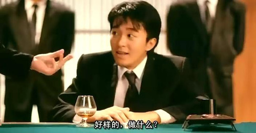
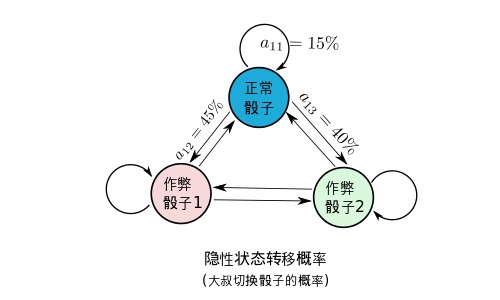
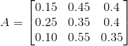
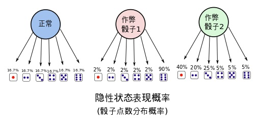
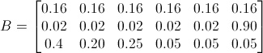
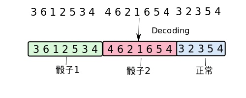
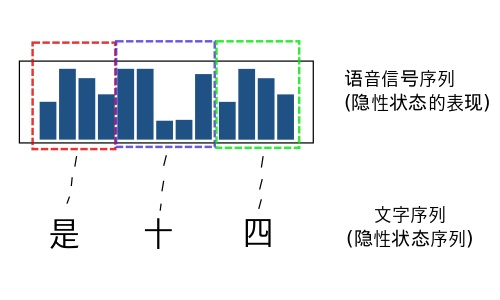

<!-- TOC -->

- [如何用简单易懂的例子解释隐马尔可夫模型？](#如何用简单易懂的例子解释隐马尔可夫模型)
    - [1. 赌场风云(背景介绍)](#1-赌场风云背景介绍)
    - [2. HMM是何许人也?](#2-hmm是何许人也)
    - [3. HMM能干什么!](#3-hmm能干什么)
        - [3.1 解码(Decoding)](#31-解码decoding)
        - [3.2 学习(Learning)](#32-学习learning)
        - [3.3 估计(Evaluation)](#33-估计evaluation)
    - [4. HMM是怎么做到的?](#4-hmm是怎么做到的)
    - [5. HMM 的应用](#5-hmm-的应用)
        - [5.1 语音识别](#51-语音识别)
        - [5.2 手写识别](#52-手写识别)
        - [5.3 中文分词](#53-中文分词)
        - [5.4 HMM实现拼音输入法](#54-hmm实现拼音输入法)

<!-- /TOC -->
# 如何用简单易懂的例子解释隐马尔可夫模型？

写在前面：**本文摘自[zhihu@Nong Bloody][Nong Bloody]对问题[如何用简单易懂的例子解释隐马尔可夫模型？][question]的[回答][answer]。** 觉得这个例子很有趣，于是便在阅读的时候顺路整理出来如下的文章。

[Nong Bloody]:https://www.zhihu.com/people/bloodyNong/activities
[question]:https://www.zhihu.com/question/20962240
[answer]:https://www.zhihu.com/question/20962240/answer/33561657

## 1. 赌场风云(背景介绍)

<div align="center"></div>

最近一个赌场的老板发现生意不畅，于是派出手下去赌场张望。经探子回报，有位大叔在赌场中总能赢到钱，玩得一手好骰子，几乎是战无不胜。而且每次玩骰子的时候周围都有几个保镖站在身边，让人不明觉厉，只能看到每次开局，骰子飞出，沉稳落地。老板根据多年的经验，推测这位不善之客使用的正是江湖失传多年的"偷换骰子大法”(编者注:偷换骰子大法，用兜里自带的骰子偷偷换掉均匀的骰子)。老板是个冷静的人，看这位大叔也不是善者，不想轻易得罪他，又不想让他坏了规矩。正愁上心头，这时候进来一位名叫HMM帅哥，告诉老板他有一个很好的解决方案。

不用近其身，只要在远处装个摄像头，把每局的骰子的点数都记录下来。
然后HMM帅哥将会运用其强大的数学内力，用这些数据推导出
1. 该大叔是不是在出千?
2. 如果是在出千，那么他用了几个作弊的骰子?　还有当前是不是在用作弊的骰子。
3. 这几个作弊骰子出现各点的概率是多少?

天呐，老板一听，这位叫HMM的甚至都不用近身，就能算出是不是在作弊，甚至都能算出别人作弊的骰子是什么样的。那么，只要再当他作弊时，派人围捕他，当场验证骰子就能让他哑口无言。

## 2. HMM是何许人也?

在让HMM开展调查活动之前，该赌场老板也对HMM作了一番调查。

HMM(Hidden Markov Model), 也称**隐性马尔可夫模型**，是一个概率模型，**用来描述一个系统隐性状态的转移和隐性状态的表现概率**。

**系统的隐性状态指的就是一些外界不便观察(或观察不到)的状态**,比如在当前的例子里面, 系统的状态指的是大叔使用骰子的状态，即：

```
{正常骰子, 作弊骰子1, 作弊骰子2,...}
```

**隐性状态的表现也就是,可以观察到的，由隐性状态产生的外在表现特点**。这里就是说, 骰子掷出的点数： 
```
{1,2,3,4,5,6}
```

HMM模型将会描述，系统隐性状态的转移概率。也就是大叔切换骰子的概率,下图是一个例子，这时候大叔切换骰子的可能性被描述得淋漓尽致。

<div align="center"></div>

很幸运的，这么复杂的概率转移图，竟然能用简单的矩阵表达, 其中代表的是从i状态转移到j状态发生的概率。

<div align="center"></div>

当然同时也会有，隐性状态表现概率。也就是骰子出现各点的概率分布(e.g. 作弊骰子1能有90%的机会掷到六，作弊骰子2有85%的机会掷到'小’). 如图：

<div align="center"></div>

隐性状态的表现概率也可以用矩阵表示出来：

<div align="center"></div>

把这两个东西总结起来，就是整个HMM模型。

**这个模型描述了隐性状态的转换的概率，同时也描述了每个状态外在表现的概率的分布**。总之，HMM模型就能够描述扔骰子大叔作弊的频率(骰子更换的概率)，和大叔用的骰子的概率分布。有了大叔的HMM模型，就能把大叔看透，让他完全在阳光下现形。

## 3. HMM能干什么!

总结起来HMM能处理三个问题。

### 3.1 解码(Decoding)

解码就是需要从一连串的骰子中，看出来哪一些骰子是用了作弊的骰子，哪些是用的正常的骰子。

<div align="center"></div>

比如上图中，给出一串骰子序列(3,6,1,2..)和大叔的HMM模型, 我们想要计算哪一些骰子的结果(隐性状态表现)可能对是哪种骰子的结果(隐性状态).

### 3.2 学习(Learning)

学习就是，从一连串的骰子中，学习到大叔切换骰子的概率（**矩阵A**），当然也有这些骰子的点数的分布概率（**矩阵B**）。这是HMM最为恐怖也最为复杂的招数！！

### 3.3 估计(Evaluation)

估计说的是，在我们已经**知道了该大叔的HMM模型的情况下**，估测**某串**骰子出现的可能性概率。比如说，在我们已经知道大叔的HMM模型的情况下，我们就能直接估测到大叔扔到10个6或者8个1的概率。

## 4. HMM是怎么做到的?

这里建议不看原文的推导，原文作者没有对使用的符号进行较明确的说明，推导过程也没仔细引入，这里建议看其他教程来学习推导过程。

## 5. HMM 的应用

以上举的例子是用HMM对掷骰子进行建模与分析。当然还有很多HMM经典的应用，能根据不同的应用需求，对问题进行建模。

但是使用HMM进行建模的问题，必须满足以下条件:

- 1.隐性状态的转移必须满足马尔可夫性。(状态转移的n阶马尔可夫性:一个状态只与前n个状态有关)
- 2.隐性状态必须能够大概被估计。

在满足条件的情况下,确定问题中的隐性状态是什么,隐性状态的表现可能又有哪些.

HMM适用于的问题在于，真正的状态(隐态)难以被估计，而状态与状态之间又存在联系。

### 5.1 语音识别

语音识别问题就是**将一段语音信号转换为文字序列的过程**.在个问题里面，隐性状态就是: 语音信号对应的文字序列，而显性的状态就是: 语音信号。

<div align="center"></div>

HMM模型的学习(Learning): 

语音识别的模型学习和上文中通过观察骰子序列建立起一个最有可能的模型不同。语音识别的HMM模型学习有两个步骤:

- 1.统计文字的发音概率,建立隐性表现概率矩阵Ｂ
- 2.统计字词之间的转换概率(这个步骤并不需要考虑到语音,可以直接统计字词之间的转移概率即可)

语音模型的估计(Evaluation): 

计算"是十四”,"四十四"等等的概率,比较得出最有可能出现的文字序列.

### 5.2 手写识别

这是一个和语音差不多,只不过手写识别的过程是将字的图像当成了显性序列.
 
### 5.3 中文分词

>“在汉语中，词与词之间不存在分隔符（英文中，词与词之间用空格分隔，这是天然的分词标记），词本身也缺乏明显的形态标记，因此，中文信息处理的特有问题就是如何将汉语的字串分割为合理的词语序。例如，英文句子：you should Go to kindergarten now 天然的空格已然将词分好，只需要去除其中的介词“to”即可；而“你现在应该去幼儿园了”这句表达同样意思的话没有明显的分隔符，中文分词的目的是，得到“你/现在/应该/去/幼儿园/了”。那么如何进行分词呢？主流的方法有三种：

>>第1类是基于语言学知识的规则方法，如：各种形态的最大匹配、最少切分方法；

>>第2类是基于大规模语料库的机器学习方法，这是目前应用比较广泛、效果较好的解决方案．用到的统计模型有N元语言模型、信道—噪声模型、最大期望、HMM等。

>>第3类也是实际的分词系统中用到的，即规则与统计等多类方法的综合。”

引用自：[52nlp][52nlp]

[52nlp]:http://www.52nlp.cn/itenyh%E7%89%88-%E7%94%A8hmm%E5%81%9A%E4%B8%AD%E6%96%87%E5%88%86%E8%AF%8D%E4%B8%80%EF%BC%9A%E5%BA%8F

### 5.4 HMM实现拼音输入法

拼音输入法,是一个估测拼音字母对应想要输入的文字(隐性状态)的过程(比如, ‘pingyin’ -> 拼音)